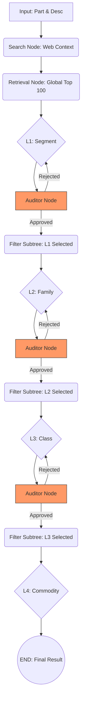

# Agentic UNSPSC Classifier

A fully private, 100% offline, local-first web application that classifies procurement parts into the UNSPSC hierarchy using agentic LLM reasoning and recursive semantic vector retrieval.

Powered by **WebLLM**, **WebGPU**, and **Transformers.js**, this application runs a large language model (`Phi-3.5-mini-instruct`) and an embedding model entirely inside your browser. No API keys, no server costs, and absolutely zero data leaves your machine.

## 🌟 Live URL

🔗 Use the app at [https://borjinipun.github.io/web-unspsc-agent-classifier/](https://borjinipun.github.io/web-unspsc-agent-classifier/)

## Key Features

- **100% Client-Side Inference:** Powered by `@mlc-ai/web-llm` utilizing your device's GPU via WebGPU.
- **Recursive Subtree Retrieval:** Unlike standard RAG, this system performs a fresh semantic retrieval at *every* taxonomic level (L1 -> L4), restricted to the selected branch to ensure 100% hierarchical integrity.
- **Agentic Audit & Reflection:** Every classification step is reviewed by a secondary **Auditor LLM**. If the choice is rejected, the agent performs a targeted retry with negative feedback to eliminate "hallucination loops."
- **Dashboard UI (High-Density):** Optimized for 1800px+ screens with a premium glassmorphism design. All diagnostic tools (Top K Retrieval and Agent Trace) are anchored as collapsible footers to maximize vertical space.
- **Enriched Prompting:** Classification options are dynamically enriched with real-world examples fetched from the semantic retrieval engine (e.g., L2 Family choices are appended with "Top Matches: [Commodity A, B, C]").
- **Resilient Web Context:** Automatically fetches and distills product context via DuckDuckGo, with a zero-shot inference fallback for air-gapped environments.

## Agentic Logic & Workflow

The application orchestrates a complex agentic loop that balances hierarchical taxonomy with per-level semantic search.



### The "Subtree-Aware" Advantage
Standard vector search often ignores hierarchical constraints. The **Agentic UNSPSC Classifier** solves this by:
1. **Global Retrieval**: Finds the top 100 commodities across the entire 150k+ list to identify the general "vicinity" of the product.
2. **Path Injection**: The full hierarchical path (`L1 > L2 > L3 > L4`) of the top candidates is used to guide the LLM at every level.
3. **Local Filtering**: At each transition (e.g., once a Segment is picked), the vector search is re-run, filtering the index to *only* allow codes that are valid children of the current selection.

## Tech Stack

- **Frontend:** Vanilla HTML5, CSS3, JavaScript (ES6 Modules)
- **Inference:** WebLLM (MLC-AI) via WebGPU.
- **Embeddings:** Transformers.js (`all-MiniLM-L6-v2`).
- **Model:** `Phi-3.5-mini-instruct-q4f16_1-MLC` (approx. 2.3GB).
- **Architecture:** LangGraph-inspired state machine.

## How to Run Locally

1. Clone this repository.
2. Start a local HTTP server (required for CORS and WebGPU modules):
   ```bash
   python -m http.server 8000
   ```
3. Open a WebGPU-enabled browser (Chrome 113+, Edge) to `http://localhost:8000`.

## Explainability & Privacy

Privacy is the core tenet of this tool. No product data is ever sent to an external LLM provider. The **Agent Trace Log** provides full transparency into the semantic search results, auditor feedback, and the deterministic path taken for every classification.
