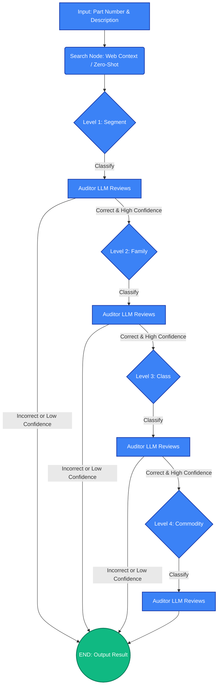

# UNSPSC EdgeClassifier

A fully private, 100% offline, local-first web application that classifies procurement parts into the UNSPSC hierarchy using agentic LLM reasoning.

Powered by **WebLLM** and **WebGPU**, this application runs a large language model (`Phi-3.5-mini-instruct`) entirely inside your browser. No API keys, no server costs, and absolutely zero data leaves your machine.

## 🌟 Live URL

🔗 Use the app at [https://borjinipun.github.io/web-unspsc-agent-classifier/](https://borjinipun.github.io/web-unspsc-agent-classifier/)

## Features

- **100% Client-Side Inference:** Powered by `@mlc-ai/web-llm` utilizing your device's GPU via WebGPU.
- **Agentic LangGraph Orchestration:** Iteratively navigates the UNSPSC taxonomy (Segment -> Family -> Class -> Commodity) using a custom, 100% offline implementation of the LangGraph state-based architecture.
- **Retrospective Auditing:** At each classification level, a secondary LLM auditor dynamically reviews the chosen category. If hallucination or incorrect logic is detected, the agent halts to prevent bad routing and suggests an alternative.
- **Resilient Context Extraction:** Automatically fetches web search snippets to distill actionable context. If the web proxy fails or you are offline, it seamlessly falls back to **Zero-Shot Context Inference**, predicting the industry and use-case purely from the Part Number.
- **Flexible Hardware Support:** Dynamically switch between Gemma-2B (Mobile/Light), Phi-3.5-mini (Balanced), and Llama-3.1-8B (Heavy laptops).

## Agentic Workflow

The application runs a local State-Graph loop that recursively classifies the product, performing a secondary validation (audit) at every single level to prevent hallucination.



## Tech Stack

- **Frontend:** Vanilla HTML5, CSS3, JavaScript (ES6 Modules)
- **Styling:** Custom CSS with Glassmorphism, Dark Mode, and CSS Variables. No external CSS frameworks.
- **Inference Engine:** WebLLM (MLC-AI) via WebGPU
- **Default Model:** `Phi-3.5-mini-instruct-q4f16_1-MLC` (approx. 2.3GB)
- **Data:** Pre-processed `unspsc.json` loaded directly into memory.

## How to Run Locally

Because the application fetches local files (like `unspsc.json` and model chunks), you cannot simply double-click the `index.html` file due to browser CORS restrictions. You must run a local web server:

1. Clone this repository.
2. Navigate to the project root in your terminal.
3. Start a local HTTP server in the root directory:
   ```bash
   python -m http.server 8000
   ```
4. Open your WebGPU-enabled browser (Chrome, Edge) and navigate to `http://localhost:8000`.

## Deployment (GitHub Pages)

Since this project consists purely of static files (`index.html`, `style.css`, `js/*.js`, and `unspsc.json`), it is designed to be hosted entirely for free on **GitHub Pages**.

To deploy to GitHub Pages:
1. Go to your GitHub repository **Settings** > **Pages**.
2. Under "Build and deployment", select **Deploy from a branch**.
3. Select your `main` branch.
4. Set the directory to `/(root)`.
5. Save and wait for the deployment to finish! Your application is now live at `https://<your-username>.github.io/<repository-name>/`.

## Explainability & Privacy

Privacy is a core tenet of this tool. No product data is ever sent to an external LLM provider. The web search is performed via a CORS proxy for context enrichment, but the actual classification logic executes locally on your GPU. The expandable Debug Traces allow users to audit the exact reasoning path the model took to reach its final UNSPSC commodity code.
